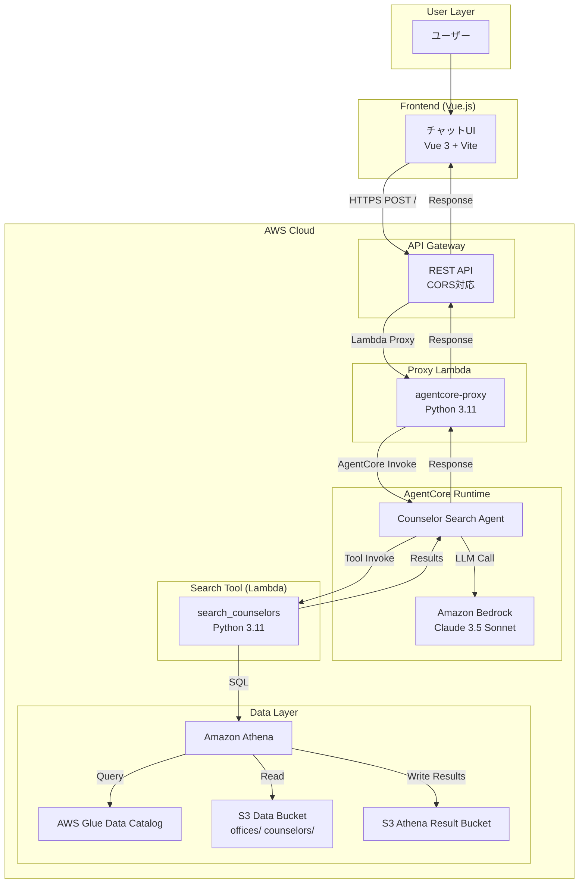
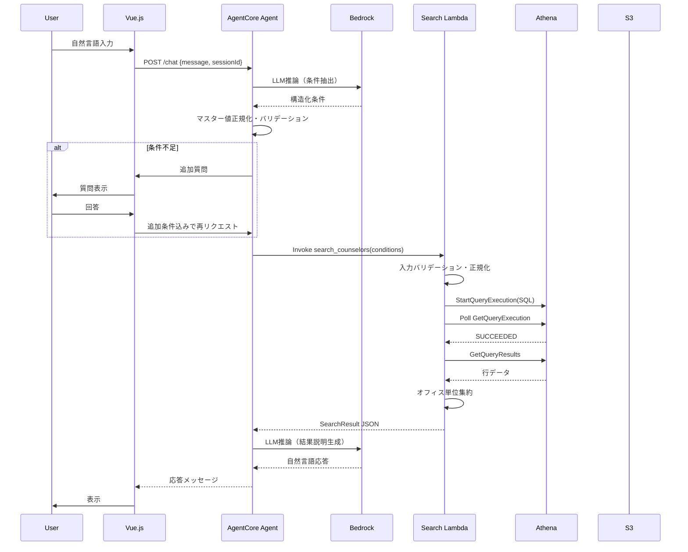
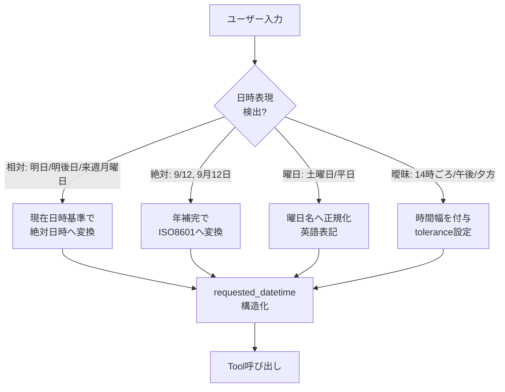
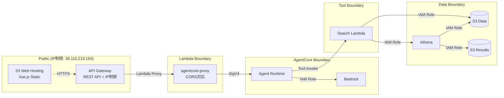

アーキテクチャ設計書：カウンセラー検索AIデモ

## 1. システム全体構成



## 2. コンポーネント設計

### 2.1 フロントエンド（Vue.js）

| コンポーネント | 責務 | 技術スタック |
|--------------|------|-------------|
| `App.vue` | ルート・レイアウト | Vue 3 Composition API |
| `ChatView.vue` | チャット画面全体 | Pinia (状態管理) |
| `MessageList.vue` | メッセージ履歴表示 | 仮想スクロール対応 |
| `MessageBubble.vue` | 単一メッセージ表示 | Markdownレンダリング |
| `InputArea.vue` | 入力フォーム・送信 | Enter送信・Shift+Enter改行 |
| `LoadingIndicator.vue` | Agent思考中表示 | スピナー・ステータス文言 |
| `api/client.ts` | AgentCore通信 | fetch API・エラーハンドリング |

**状態管理（Pinia store）:**
```typescript
interface ChatState {
  messages: Message[]           // 会話履歴
  isLoading: boolean            // Agent実行中フラグ
  sessionId: string             // AgentCoreセッションID
  currentDatetime: string       // 現在日時（Asia/Tokyo ISO8601）
}
```

### 2.2 AgentCore Runtime / Agent

| コンポーネント | 責務 | 実装詳細 |
|--------------|------|---------|
| `CounselorSearchAgent` | 会話制御・条件抽出・Tool呼出・応答生成 | Bedrock AgentCore Runtime |
| `SystemPrompt` | エージェント指示・マスター値定義・日時正規化ルール | プロンプトエンジニアリング |
| `ToolDefinition` | `search_counselors` Tool仕様・入力スキーマ | JSON Schema |
| `SessionManager` | 会話状態保持・現在日時注入 | AgentCore標準機能 |

**Agent システムプロンプト構成:**
```
1. 役割定義：カウンセラー検索アシスタント
2. 検索条件スキーマ説明（stations, expertise, methods, genders, ages, requested_datetime）
3. マスターデータ一覧（駅・専門領域・方法・性別・年代）
4. 日時正規化ルール（相対・絶対・曖昧表現の変換規則）
5. 追加質問ポリシー（不足時のみ・再質問禁止・勝手な緩和禁止）
5. Tool呼び出し規約（入力バリデーション・マスター値限定）
6. 応答生成ガイドライン（事実のみ・診断断定禁止・0件時の確認誘導）
```

### 2.3 Search Tool（Lambda）

| モジュール | 責務 | 主要関数 |
|-----------|------|---------|
| `handler.py` | Lambdaエントリーポイント・入出力 | `lambda_handler(event, context)` |
| `validator.py` | Tool入力バリデーション・マスター値照合 | `validate_conditions()`, `normalize_values()` |
| `sql_builder.py` | 動的SQL生成（条件・日時・JOIN） | `build_search_sql()` |
| `athena_client.py` | Athena実行・ポーリング・結果取得 | `execute_query()`, `wait_for_completion()`, `fetch_results()` |
| `aggregator.py` | 行データ→オフィス単位集約 | `aggregate_offices()` |
| `models.py` | データクラス・型定義 | `SearchConditions`, `OfficeResult`, `CounselorMatch` |

### 2.4 データ層

| リソース | 仕様 |
|---------|------|
| S3 Data Bucket | `s3://counseling-demo-data-<account-id>/offices/`, `/counselors/` |
| Glue Database | `counseling_demo` |
| Glue Tables | `offices` (JSONL), `counselors` (JSONL) |
| Athena WorkGroup | `counseling-demo-wg` (結果: `s3://<result-bucket>/query-results/`) |

## 3. データモデル

### 3.1 Office（オフィス）

```json
{
  "id": "string",
  "office_name": "string",
  "nearest_stations": "array<string>",
  "opening_hours_specification": "array<struct<dayOfWeek:string, opens:string, closes:string>>"
}
```

**Athenaスキーマ:**
```sql
CREATE EXTERNAL TABLE counseling_demo.offices (
    id STRING,
    office_name STRING,
    nearest_stations ARRAY<STRING>,
    opening_hours_specification ARRAY<STRUCT<dayOfWeek:STRING, opens:STRING, closes:STRING>>
)
ROW FORMAT SERDE 'org.openx.data.jsonserde.JsonSerDe'
LOCATION 's3://<bucket>/offices/';
```

### 3.2 Counselor（カウンセラー）

```json
{
  "office_id": "string",
  "name": "string",
  "area_of_expertise": "array<string>",
  "gender": "string",
  "method": "array<string>",
  "age": "string"
}
```

**Athenaスキーマ:**
```sql
CREATE EXTERNAL TABLE counseling_demo.counselors (
    office_id STRING,
    name STRING,
    area_of_expertise ARRAY<STRING>,
    gender STRING,
    method ARRAY<STRING>,
    age STRING
)
ROW FORMAT SERDE 'org.openx.data.jsonserde.JsonSerDe'
LOCATION 's3://<bucket>/counselors/';
```

### 3.3 検索条件（Tool入力）

```typescript
interface SearchConditions {
  stations: string[]              // 駅マスター値のみ
  area_of_expertise: string[]     // 専門領域マスター値のみ
  methods: string[]               // 方法マスター値のみ
  genders: string[]               // 性別マスター値のみ
  ages: string[]                  // 年代マスター値のみ
  requested_datetime: DateTimeCondition | null
}

interface DateTimeCondition {
  // 絶対日時指定（優先）
  start?: string                  // ISO 8601 (Asia/Tokyo)
  end?: string                    // ISO 8601 (Asia/Tokyo)
  // 曜日指定（絶対日時未指定時）
  day_of_week?: "Monday"|"Tuesday"|"Wednesday"|"Thursday"|"Friday"|"Saturday"|"Sunday"
  around?: string                 // "HH:mm"
  tolerance_minutes?: number      // デフォルト60
}
```

### 3.4 検索結果（Tool出力）

```typescript
interface SearchResult {
  count: number
  results: OfficeResult[]
}

interface OfficeResult {
  office_id: string
  office_name: string
  nearest_stations: string[]
  matched_counselors: CounselorMatch[]
}

interface CounselorMatch {
  name: string
  gender: string
  age: string
  methods: string[]
  area_of_expertise: string[]
}
```

## 4. データフロー・シーケンス

### 4.1 検索リクエストフロー



### 4.2 日時正規化フロー（Agent内部）



## 5. 検索ロジック詳細

### 5.1 条件結合ルール

| 条件レベル | 結合 |
|-----------|------|
| 同一項目内（複数値） | OR |
| 項目間 | AND |

**例:** `stations: ["新宿駅", "代々木駅"]` + `genders: ["女性"]` + `methods: ["オンライン"]`
→ `(新宿駅 OR 代々木駅) AND 女性 AND オンライン`

### 5.2 営業時間判定ロジック

**絶対日時指定時:**
```sql
EXISTS (
  SELECT 1 FROM UNNEST(o.opening_hours_specification) AS t(day)
  WHERE day.dayOfWeek = '<該当曜日>'
    AND CAST(day.opens AS TIME) <= TIME '<希望開始時刻>'
    AND CAST(day.closes AS TIME) >= TIME '<希望終了時刻>'
)
```

**曜日・時間幅指定時（14時ごろ＝13:00-15:00）:**
```sql
EXISTS (
  SELECT 1 FROM UNNEST(o.opening_hours_specification) AS t(day)
  WHERE day.dayOfWeek = 'Saturday'
    AND CAST(day.opens AS TIME) <= TIME '13:00:00'
    AND CAST(day.closes AS TIME) >= TIME '15:00:00'
)
```

### 5.3 カウンセラー条件判定

同一カウンセラーが全指定条件を満たすことを要求（別カウンセラーの組合せ不可）。

```sql
-- 例: 女性 AND オンライン AND 不安
c.gender IN ('女性')
AND contains(c.method, 'オンライン')
AND contains(c.area_of_expertise, '不安／緊張')
```

## 6. エラーハンドリング方針

| 階層 | エラー種別 | 対応 |
|------|-----------|------|
| UI | ネットワークエラー | リトライボタン表示・オフライン検知 |
| UI | AgentCoreエラー | ユーザー向けメッセージ「一時的なエラーです」 |
| Agent | LLM呼び出し失敗 | リトライ（最大3回）・フォールバック応答 |
| Agent | Tool実行失敗 | エラー内容をログ・ユーザーには「検索に失敗しました」 |
| Lambda | 入力バリデーション失敗 | 400返却・詳細ログ |
| Lambda | Athena実行失敗 | 最大3回リトライ・失敗時エラー返却 |
| Lambda | Athenaタイムアウト | 5分でタイムアウト・エラー返却 |
| Athena | クエリ失敗 | エラーログ・Lambdaへエラー伝播 |

**重要:** 内部エラー詳細（スタックトレース・SQL・AWSリソース名）をユーザーに露出しない。

## 7. セキュリティ境界



- S3 ホスティング: IP制限付きパブリックアクセス
- API Gateway: リソースポリシーでIP制限
- AgentはS3/Athenaへ直接アクセスしない（Lambda経由）
- Lambdaは最小権限（Athena/S3 Read/Writeのみ）
- 個人情報はデモデータに含めない

## 8. 将来拡張ポイント

| 拡張内容 | 影響範囲 | 対応方針 |
|---------|---------|---------|
| OpenSearch移行 | Lambda内部のみ | `sql_builder.py` → `opensearch_client.py` 置換、Tool IF維持 |
| カウンセラー空き枠検索 | データ・Lambda・Agent | `counselor_availability` テーブル追加、条件スキーマ拡張 |
| 認証追加 | UI・AgentCore・Lambda | API Gateway + Cognito Authorizer挿入 |
| 複数リージョン | CloudFormation・S3・Athena | スタックセット・クロスリージョンレプリケーション |
| 多言語対応 | Agent・UI | システムプロンプト・UI文言の外部化・i18nライブラリ導入 |