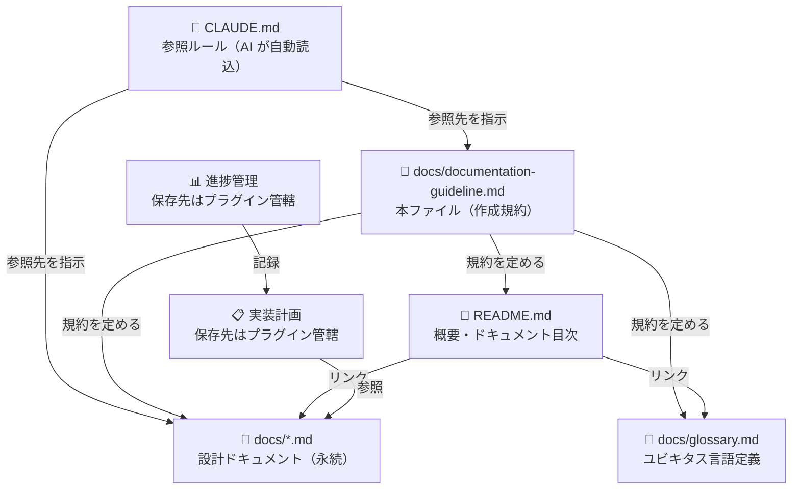
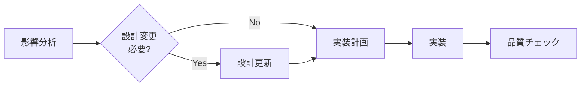

# ドキュメント作成ガイドライン

本プロジェクトのドキュメントを作成・更新する際の規約を定義します。

対象は設計ドキュメント（`docs/` 配下）・用語定義・README です。コードそのものの規約は [conventions.md](conventions.md) を参照してください。

## ドキュメント構成

各ドキュメントの役割と関係を示します。



### 1. 設計ドキュメント（`docs/`）

設計フェーズで生成（superpowers、Spec Kit などのプラグインに委任可）。基本設計や方針が変わらない限り更新しません。

保存前に「ドキュメント完了チェックリスト」セクションの設計ドキュメント項目を確認してください。

`docs/` 直下に、役割ごとに複数ファイルへ分割して配置します：

```
docs/
├── product.md         # ビジョン・ユーザー・要件・ストーリー
├── architecture.md    # システム構成・データモデル・コンポーネント設計
├── design.md          # GUIデザイン（GUIを持つ場合）
├── api.md             # API設計（該当する場合）
├── tech.md            # 技術選定（What）— スタック・ツール選定・制約・パフォーマンス要件
├── conventions.md     # 規約・手順（How）— コーディング/命名/テスト/Git規約・セットアップ・CI/CD
├── security.md        # セキュリティ設計（機密情報を扱う場合）— 脅威モデル・認証認可・暗号化・鍵管理
├── operations.md      # 運用手順（該当する場合）— 動作モード・日常運用・障害対応・デプロイ前確認
├── review.md          # レビュー方針（該当する場合）— レビュー観点・PRプロセス・承認ルール
├── glossary.md        # ユビキタス言語定義
└── documentation-guideline.md  # 本ファイル（ドキュメント作成規約）
```

各ファイルへの目次・エントリポイントは、プロジェクトルートの `README.md` が担います。`docs/` 直下に `README.md` を作成してはいけません。

`documentation-guideline.md` はプロダクトの設計ではなく「ドキュメントの書き方」を定めるメタ情報です。AI アシスタントには `CLAUDE.md` の参照ルール経由で読み込まれます。

各ファイルに含めるべき項目：

**`product.md`（プロダクト要件）**
- プロダクトビジョン・ターゲットユーザー・課題・ニーズ
- 主要な機能一覧
- ビジネス要件
- ユーザーストーリー・受け入れ条件
- 機能要件・非機能要件
- 成功の定義（要件を横断する受け入れ基準）

**`architecture.md`（機能設計）**
- アーキテクチャ・システム構成図
- データモデル（ER図含む）
- コンポーネント設計
- ユースケース図・画面遷移図・ワイヤフレーム（該当する場合）
- エラーハンドリング方針

**`design.md`（GUIデザイン、GUIを持つ場合のみ）**
- デザインコンセプト・トーン&マナー
- カラーパレット・タイポグラフィ・アイコン規約
- コンポーネント仕様（ボタン・フォーム・カード等）
- レイアウト・グリッド・レスポンシブ対応方針
- 画面デザイン・ワイヤフレーム詳細（Figma 等の外部リンク可）
- アクセシビリティ方針（コントラスト比・キーボード操作・ARIA等）

**`api.md`（API設計、バックエンドと連携する場合のみ）**
- エンドポイント一覧・リクエスト/レスポンス仕様
- 認証・認可
- エラーコード

**`tech.md`（技術選定 — 何を使うか）**
- テクノロジースタック（言語・フレームワーク・外部サービス）
- 選定した開発ツール（リンター・フォーマッター・テストフレームワーク・型チェッカー・CI/CDサービス）とその選定理由
- 技術的制約と要件（動作環境・バージョン要件・インフラ制約）
- パフォーマンス要件

**`conventions.md`（規約・手順 — どう使うか / どう書くか）**
- フォルダ・ファイル構成・ディレクトリの役割・ファイル配置ルール
- コーディング規約・命名規則・スタイリング規約・テスト規約・Git規約
- セットアップ手順・設定方法・開発コマンド（tech.md で選定したツールの実行方法）
- CI/CDワークフロー（トリガー・ステップ・デプロイ先）

**`security.md`（セキュリティ設計、個人情報・認証情報を扱う場合のみ）**
- 保護対象と機密度・想定される脅威（脅威モデル）
- 認証・認可の設計と選定理由
- 暗号化の対象・方式・鍵管理
- 攻撃対策（CSRF / XSS / SQLインジェクション / 攻撃面の縮小）
- ログと監査の方針
- 既知のリスクと残存課題（脅威との対応）

`security.md` は「設計として何をどう守っているか」を記述します。検出済みの脆弱性は `review.md` に記録し、両者の役割を分離します。

**`operations.md`（運用手順、稼働後の運用がある場合のみ）**
- 動作モード・環境変数による挙動の切り替えと影響範囲
- 日常運用のオペレーション（マスタデータの更新・データ出力・ユーザー管理など）
- ログの出力先と確認方法
- 障害時の切り分け手順（症状別）
- 鍵・認証情報の管理方針
- 本番デプロイ前チェックリスト

`conventions.md` が「開発者が実装するための手順」を扱うのに対し、`operations.md` は「稼働中のシステムを運用・保守するための手順」を扱います。

**`review.md`（レビュー方針、該当する場合のみ）**
- レビュー観点・チェック項目（correctness / maintainability / performance / security など）
- PRレビュープロセス（レビュー依頼のタイミング・レビュアー指名ルール）
- 承認ルール（必要承認数・マージ条件）
- レビューコメントの粒度・トーンのガイドライン
- セルフレビューのチェックリスト

### 2. 実装計画

計画フェーズで生成（superpowers、Spec Kit などのプラグインに委任可）。保存先はプラグイン管轄。作業完了後も履歴として保持します。

含めるべき項目：
- 変更・追加する機能の説明
- 実装アプローチ・変更コンポーネント・影響範囲
- 具体的な実装タスクと完了条件

### 3. 進捗管理

実装中の進捗を記録し、コンテキストリセット後の復旧マップとして機能します。保存先はプラグイン管轄。

### 4. ユビキタス言語定義（`docs/glossary.md`）

ドメイン用語・英日対応表・コード上の命名規則を定義します。設計ドキュメントとは独立して参照できるよう単独ファイルで管理します。

### 5. README（`README.md`）

リポジトリの顔として機能します。中央揃えロゴ → バッジ → リンク → 概要 → 特長 の構成を採用しています。

含めるべき内容：

- **SVG ロゴ** — `docs/images/logo.svg`（中央揃え、任意）
- **キャッチコピー** — イタリック・中央揃えの一行説明
- **バッジ** — CI/CD ステータス、技術スタックのバージョン等（任意）
- **重要リンク** — プロジェクト固有の外部リソースや成果物へのリンク（該当する場合）
- **アプリケーション概要・特長** — 箇条書きで主要機能を説明
- **ドキュメントへのリンク** — 設計ドキュメント（`docs/`）・用語定義（`docs/glossary.md`）

バッジ追加の指針：

- CI/CD ステータスは GitHub Actions バッジを使用する
- 技術スタック（言語バージョン等）は shields.io バッジを使用する
- `logo=` パラメータでアイコンを付与してビジュアルを強化する

SVG ロゴの注意事項：

- 画像ファイルは `docs/images/` に配置する
- GitHub の Markdown レンダラーは SVG 内の CSS `@media (prefers-color-scheme: dark)` を無効化するため、ダークモード対応には `<picture>` タグを使う必要がある

## 開発プロセス

### 初回セットアップ


1. **設計** — 設計ドキュメントを作成し `docs/` に保存（superpowers、Spec Kit などのプラグインに委任可）
2. **実装計画** — 実装計画を作成（superpowers、Spec Kit などのプラグインに委任可、保存先はプラグイン管轄）
3. **環境セットアップ** — プロジェクトの `conventions.md`（設計ドキュメント）に記載されたセットアップ手順を実行
4. **実装** — 計画に沿ってタスクを順に実装
5. **品質チェック** — プロジェクトの `conventions.md` に記載されたリンター・フォーマッター・テスト・型チェックコマンドを実行
6. **ドキュメントレビュー** — 下記チェックリストで漏れを確認

### 機能追加・修正



1. **影響分析** — `docs/` の設計ドキュメントへの影響を確認
2. **設計更新** — 基本設計に影響する場合は設計ドキュメントを更新（superpowers、Spec Kit などのプラグインに委任可）
3. **実装計画** — 新しい実装計画ファイルを作成（同上）
4. **実装** — 計画に沿って実装
5. **品質チェック**
6. **ドキュメント更新** — 「ドキュメント更新ポリシー」に従い、コード変更と同じコミットで対応ドキュメントを更新する

---

## ドキュメント更新ポリシー

ソースコードを変更した場合、**同じコミット**で対応する設計ドキュメント・用語定義・README を更新する。後回し禁止。

### 更新対象の判断

コード変更の種類に応じて、更新すべきドキュメントを判断する：

| コード変更の種類 | 更新すべきドキュメント |
|---|---|
| ビジネスロジック・機能追加/変更 | `docs/product.md` |
| アーキテクチャ・コンポーネント構成の変更 | `docs/architecture.md` |
| GUI・スタイル・UIコンポーネントの変更 | `docs/design.md` |
| API エンドポイントの追加・変更・削除 | `docs/api.md` |
| 技術スタック選定・依存ライブラリ・バージョン・インフラ変更 | `docs/tech.md` |
| ディレクトリ構成・命名規則・開発コマンド・CI/CDワークフロー変更 | `docs/conventions.md` |
| 認証・認可・暗号化・権限設計・攻撃対策の変更 | `docs/security.md` |
| 動作モード・運用オペレーション・ログ出力先・障害対応手順の変更 | `docs/operations.md` |
| レビュー観点・PRプロセス・承認ルール変更 | `docs/review.md` |
| 新しいドメイン用語・命名規則の導入 | `docs/glossary.md` |
| リポジトリの概要・特長・外部リンクの変更 | `README.md` |

### 更新原則

- **同一コミット**: コードとドキュメントは同じコミットに含める。「後で更新する」は禁止
- **図表の同期**: アーキテクチャや API を変更した場合、対応する Mermaid 図も同時に更新する
- **命名の反映**: 新しいクラス・関数・変数名は `docs/glossary.md` の命名規則パターンに反映する
- **削除の反映**: 削除されたコンポーネント・API に関する記述は設計ドキュメントからも削除する

---

## ドキュメント記載ルール

### 目次・セクション構造

セクション数が10を超える場合は、ドキュメント先頭に目次を追加する。設計ドキュメントは役割ごとに複数ファイルへ分割（詳細は「ドキュメント構成」の設計ドキュメント項参照）。サブエージェントへの受け渡しは、プロジェクトルートの `README.md` を目次役として利用する。

目次のセクションが多い場合は、関連するセクションを**太字のグループ見出し**でまとめて可読性を高める。本文にも対応する `##` グループセクションを設け、既存セクションを一段下げて `###`、その配下を `####` とする。

```
## アーキテクチャ・設計     ← グループ（##）
### アーキテクチャ           ← 従来の ## を降格
#### システム全体構成        ← 従来の ### を降格

## コンポーネント
### RSS取得（src/fetcher.py）
```

### 図表・ダイアグラム

設計図は関連する設計ドキュメント内に直接記載します。独立した `diagrams/` フォルダは作成しません。図表は必要最小限に留め、メンテナンスコストを抑えます。

記述形式（優先順）：
1. **Mermaid記法** — Markdownに直接埋め込め、バージョン管理が容易（推奨）
2. **ASCII アート** — シンプルな図表に使用
3. **画像ファイル** — 複雑なモックアップのみ。`docs/images/` に PNG または SVG で配置

設計変更時は対応する図表も同時に更新し、コードとの乖離を防ぎます。

---

## ドキュメント完了チェックリスト

実装完了後・コミット前に、以下のすべての項目を確認します。
**「はい」でない項目があれば、コミット前に追記・修正してください。**

### コード変更に伴うドキュメント更新

- [ ] コード変更に対応する設計ドキュメント（`product.md` / `architecture.md` / `design.md` / `api.md` / `tech.md` / `conventions.md` / `security.md` / `operations.md` / `review.md`）を更新した
- [ ] 変更したアーキテクチャ・API に対応する Mermaid 図を同時に更新した
- [ ] 新しいクラス・関数・変数名を `docs/glossary.md` の命名規則に反映した
- [ ] 削除されたコンポーネント・API に関する記述を設計ドキュメントから削除した
- [ ] README の概要・特長・リンクに影響がある場合、`README.md` を更新した
- [ ] コードとドキュメントの更新を**同じコミット**に含めた

### 設計ドキュメント（`docs/`）

**構造：**

- [ ] `docs/` 直下に、役割ごとに複数ファイルへ分割して配置した
- [ ] `docs/` 直下に `README.md` を作成していない（目次はプロジェクトルートの `README.md` が担う）
- [ ] 各ファイル内でセクション数が10を超える場合、先頭に目次を追加した
- [ ] （目次がある場合）セクションが多い場合、太字のグループ見出しでまとめた
- [ ] （目次がある場合）本文に対応する `##` グループセクションを設け、既存セクションを `###` に降格した

**`product.md`（プロダクト要件）：**

- [ ] プロダクトビジョン・ターゲットユーザー・課題・ニーズが記載されている
- [ ] 主要な機能一覧が記載されている
- [ ] 成功の定義が記載されている
- [ ] ビジネス要件が記載されている
- [ ] ユーザーストーリー・受け入れ条件が記載されている
- [ ] 機能要件・非機能要件が記載されている

**`architecture.md`（機能設計）：**

- [ ] システムアーキテクチャ（コンポーネント構成）が記載されている
- [ ] データモデル（主要なクラス・データ構造）が記載されている
- [ ] コンポーネント設計が記載されている
- [ ] ユースケース図・画面遷移図・ワイヤフレームが記載されている（該当する場合）
- [ ] API設計が記載されている（バックエンドと連携する場合）
- [ ] エラーハンドリング方針（リトライ・例外の種類と意図）が記載されている

**`design.md`（GUIを持つ場合）：**

- [ ] デザインコンセプト・トーン&マナーが記載されている
- [ ] カラーパレット・タイポグラフィ・アイコン規約が記載されている
- [ ] コンポーネント仕様（ボタン・フォーム・カード等）が記載されている
- [ ] レイアウト・グリッド・レスポンシブ対応方針が記載されている
- [ ] 画面デザイン・ワイヤフレーム詳細（または外部リンク）が記載されている
- [ ] アクセシビリティ方針（コントラスト比・キーボード操作・ARIA等）が記載されている

**`api.md`（該当する場合）：**

- [ ] エンドポイント一覧・リクエスト/レスポンス仕様が記載されている
- [ ] 認証・認可方針が記載されている
- [ ] エラーコードが記載されている

**`tech.md`（技術選定 — What）：**

- [ ] テクノロジースタック（言語・フレームワーク・外部サービス）が記載されている
- [ ] 選定した開発ツール（リンター・フォーマッター・テストフレームワーク・型チェッカー・CI/CDサービス）と選定理由が記載されている
- [ ] 技術的制約と要件（動作環境・バージョン要件・インフラ制約）が記載されている
- [ ] パフォーマンス要件が記載されている

**`conventions.md`（規約・手順 — How）：**

- [ ] フォルダ・ファイル構成とディレクトリの役割・ファイル配置ルールが記載されている
- [ ] コーディング規約・命名規則・スタイリング規約が記載されている
- [ ] 命名規則が `docs/glossary.md` を参照している
- [ ] テスト規約（テストの書き方・カバレッジ方針）が記載されている
- [ ] Git規約（コミットメッセージ規則など）が記載されている
- [ ] セットアップ手順・設定方法・開発コマンド（tech.md で選定したツールの実行方法）が記載されている
- [ ] CI/CDワークフロー（トリガー・ステップ・デプロイ先）が記載されている

**`security.md`（個人情報・認証情報を扱う場合）：**

- [ ] 保護対象と機密度・想定される脅威が記載されている
- [ ] 認証・認可の設計と選定理由が記載されている
- [ ] 暗号化の対象・方式・鍵管理方針が記載されている
- [ ] 攻撃対策（CSRF / XSS / SQLインジェクション / 攻撃面の縮小）が記載されている
- [ ] ログと監査の方針が記載されている
- [ ] 既知のリスクと残存課題が脅威と対応づけて記載されている

**`operations.md`（稼働後の運用がある場合）：**

- [ ] 動作モード・環境変数による挙動の切り替えと影響範囲が記載されている
- [ ] 日常運用のオペレーション手順が記載されている
- [ ] ログの出力先と確認方法が記載されている
- [ ] 障害時の切り分け手順が症状別に記載されている
- [ ] 鍵・認証情報の管理方針が記載されている
- [ ] 本番デプロイ前チェックリストが記載されている

**`review.md`（該当する場合）：**

- [ ] レビュー観点・チェック項目（correctness / maintainability / performance / security など）が記載されている
- [ ] PRレビュープロセス（レビュー依頼のタイミング・レビュアー指名ルール）が記載されている
- [ ] 承認ルール（必要承認数・マージ条件）が記載されている
- [ ] レビューコメントの粒度・トーンのガイドラインが記載されている
- [ ] セルフレビューのチェックリストが記載されている

**図表の網羅性（該当ファイル内に配置）：**

- [ ] システム全体構成図（外部サービス・コンポーネントの関係）を Mermaid で記載した
- [ ] パイプライン・データフロー図を Mermaid で記載した
- [ ] 主要なクラス・インターフェースの関係を classDiagram で記載した
- [ ] 複雑なシーケンス（HTTP通信・非同期処理など）を sequenceDiagram で記載した

### 用語定義（`docs/glossary.md`）

- [ ] ドメイン用語・ビジネス用語が定義されている
- [ ] UI/UX用語が定義されている（該当する場合）
- [ ] 英語・日本語対応表が記載されている
- [ ] コード上の命名規則が記載されている
- [ ] 新しいコンポーネント・関数・変数名のパターンが命名規則に反映されている

### README（`README.md`）

プロジェクトルートの `README.md` は、リポジトリの顔と設計ドキュメントの目次を兼ねます。

- [ ] `docs/images/logo.svg` が存在し、中央揃えで表示されている（ロゴを使用している場合）
- [ ] キャッチコピー（プロジェクトを一行で説明する文言）が記載されている
- [ ] CI/CD バッジが最新のワークフロー名と一致している
- [ ] プロジェクト固有の重要リンク（外部リソース・成果物など）が有効である
- [ ] アプリケーション概要・特長が記載されている
- [ ] 設計ドキュメント（`docs/`）の各ファイルへのリンクと概要が記載されている
- [ ] 用語定義（`docs/glossary.md`）へのリンクが有効である

### 実装計画

- [ ] すべてのタスクに完了状態（完了済みかどうか）が記録されている
